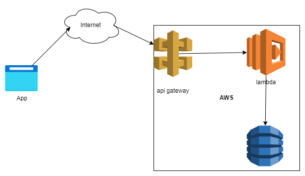

# Overview
Restuarant API in ation

## Architecture


## API Gateway
## Lambda
* Get Menu Items
  ```python
        import json
        import boto3
        from boto3.dynamodb.conditions import Key
        from decimal import Decimal

        class DecimalEncoder(json.JSONEncoder):
        def default(self, obj):
            if isinstance(obj, Decimal):
            return str(obj)
            return json.JSONEncoder.default(self, obj)
            
        def execute_query(pk, sk=None):
            dynamodb = boto3.resource('dynamodb')
            table = dynamodb.Table('Restaurant')
            response = table.query(KeyConditionExpression=Key('PartitionKey').eq(pk))
            return response["Items"]
                
        def lambda_handler(event, context):
            
            menuitems = execute_query('MENU')
            return {
                'statusCode': 200,
                #'body': json.dumps([obj.__dict__ for obj in menuitems])
                'body': json.dumps(menuitems, cls=DecimalEncoder)
            }   
  ```
___

* Add menu item

    ```python
    import json
    import boto3
    from boto3.dynamodb.conditions import Key
    from decimal import Decimal

    class DecimalEncoder(json.JSONEncoder):
    def default(self, obj):
        if isinstance(obj, Decimal):
        return str(obj)
        return json.JSONEncoder.default(self, obj)
        
    def execute_query(pk, sk=None):
        dynamodb = boto3.resource('dynamodb')
        table = dynamodb.Table('Restaurant')
        response = table.query(KeyConditionExpression=Key('PartitionKey').eq(pk))
        return response["Items"]
            
    def lambda_handler(event, context):
        
        menuitems = execute_query('MENU')
        return {
            'statusCode': 200,
            #'body': json.dumps([obj.__dict__ for obj in menuitems])
            'body': json.dumps(menuitems, cls=DecimalEncoder)
        }
    ```
## Dynamo DB
### Design

|    |    |
|----|----|
| PartitionKey   | __MENU__    |
| SortingKey   | __MENUITEM__    |

___

### Sample Data
```csv
    "PartitionKey","SortingKey","category","entry_type","name","price"
    "MENU","BHAGARA BAINGAN","ENTRIES","menu_item","BHAGARA BAINGAN","14"
    "MENU","CASHEW KORMA","ENTRIES","menu_item","CASHEW KORMA","16"
    "MENU","DAL TADKA","ENTRIES","menu_item","DAL TADKA","12"
    "MENU","DOUBLE KA MEETA","DESSERT","menu_item","DOUBLE KA MEETA","5"
    "MENU","GULAB JAMUN","DESSERT","menu_item","GULAB JAMUN","4"
    "MENU","MALAI KOFTA","ENTRIES","menu_item","MALAI KOFTA","15"
    "MENU","MASALA VADA","STARTERS","menu_item","MASALA VADA","10"
    "MENU","NAVARATHAN KURMA","ENTRIES","menu_item","NAVARATHAN KURMA","16"
    "MENU","PAKORA","STARTERS","menu_item","PAKORA","8"
    "MENU","PALAK PANNEER","ENTRIES","menu_item","PALAK PANNEER","15"
```
____

### DynamoDB code

* Get menu items
    ```python
        import json
        import boto3
        from boto3.dynamodb.conditions import Key

        from decimal import Decimal

        class DecimalEncoder(json.JSONEncoder):
        def default(self, obj):
            if isinstance(obj, Decimal):
            return str(obj)
            return json.JSONEncoder.default(self, obj)

        def execute_query(pk, sk=None):
            dynamodb = boto3.resource('dynamodb')
            table = dynamodb.Table('Restaurant')
            response = table.query(KeyConditionExpression=Key('PartitionKey').eq(pk))
            return response["Items"]

        menuitems = execute_query('MENU')
        print(json.dumps(menuitems, cls=DecimalEncoder))

    ```
* Add Menu Item
    ```python
    import boto3
    from boto3.dynamodb.conditions import Key

    def add_menuitem(category, name, price):
        dynamodb = boto3.resource('dynamodb')
        table = dynamodb.Table('Restaurant')

        table.put_item(
                Item={
                    'PartitionKey': 'MENU',
                    'SortingKey': name,
                    'entry_type': 'menu_item',
                    'category' : category,
                    'name': name, 
                    'price' : price
                }
            )

    add_menuitem('STARTERS','MASALA VADA',10)
    ```
___

## Testing
* Get Menu items
```cmd
    curl https://<deployed_aws_gateway_url>/myrestaurant/menu   
```
* Add Menu item
```cmd
curl -v -X POST -H "Content-Type: application/json" -d '{"name":"CASHEW KORMA","price":16.0,"category":"ENTRIES"}'  https://<deployed_aws_gateway_url>/prod/myrestaurant/menu    
```

____